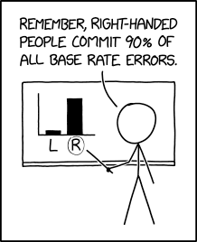
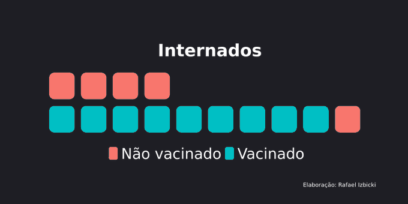
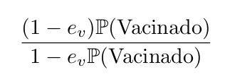
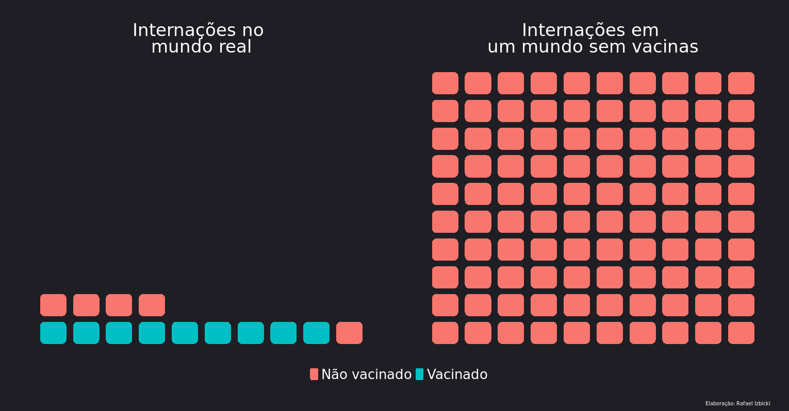
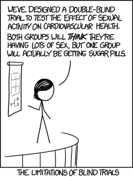
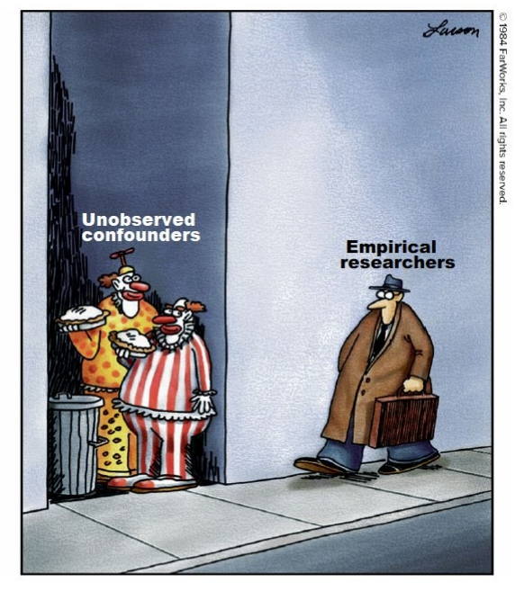
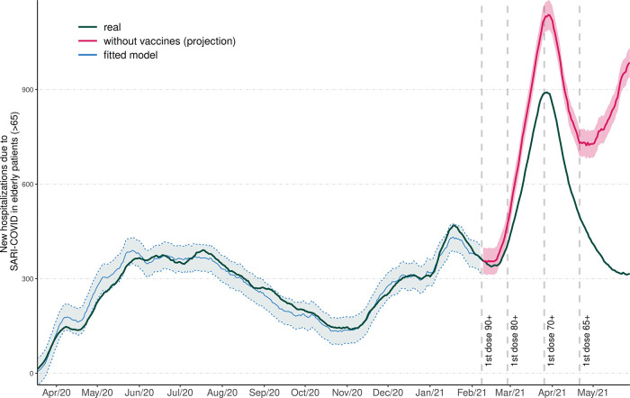
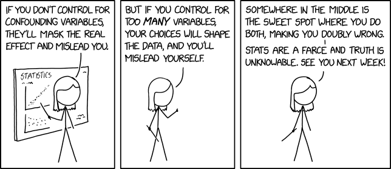

###  *"Quase todo mundo que está hospitalizado é vacinado. Vacinas não funcionam =("* 

Esse pensamento passa na cabeça de muita gente e é muito usado por anti-vacinas. Mas o argumento é correto? 
**NÃO!** Essa falácia é chamada de **base rate fallacy**. Mostro aqui o porquê. 

{style="display: block; margin: 0 auto"}

Vamos começar com um exemplo simples: como todas as vacinas têm uma chance de falhar, se todo mundo fosse vacinado, os poucos casos de internações necessariamente ocorreriam em vacinados. Isso daria a impressão que a vacina não funciona.
O mesmo vale em um cenário mais realista. Por exemplo, essa figura mostra quantos internados vacinados esperamos observar em uma população com cobertura 95% de uma vacina com eficácia 90%. A maioria dos internados é vacinado.

{style="display: block; margin: 0 auto"}

A conta para avaliar essa proporção vem do Teorema de Bayes e é dada pela seguinte equação, em que eᵥ denota a eficácia da vacina e P(Vacinado) é a proporção de vacinados.

### *"Ué, mas cadê a vacina funcionando?"* 

Aí vem o interessante: o número total internados é que diminuiu com a vacinação. Essencialmente, a eficácia da vacina pode ser pensada em termos de quantas hospitalizações foram evitadas. Veja como a comparação fica para os números acima.

{style="display: block; margin: 0 auto"}
 

Fiz aqui um app para quem quiser brincar com os valores de eficácia/cobertura vacinal para ver o que acontece em termos de hospitalizações observadas e evitadas: [https://t.co/nEDshfptsW](https://t.co/nEDshfptsW).

### *"Mas se não observamos o que teria acontecido sem as vacinas, como conseguimos estimar sua eficácia?"* 

Para isso precisamos de experimentos e/ou modelos mais complexos.
Por exemplo, na fase 3 do desenvolvimento de uma vacina, sorteamos quem recebe vacina ou placebo.

 

 

Com isso conseguimos avaliar quantas internações ocorreram a mais em um grupo que no outro.
Avaliar as vacinas em funcionamento com dados reais observados em hospitais é mais complexo e exige modelos estatísticos mais elaborados e com mais suposições. 

 

Por exemplo, em [https://pubmed.ncbi.nlm.nih.gov/34495082/](https://pubmed.ncbi.nlm.nih.gov/34495082/), utilizamos um grupo etário não vacinado para avaliar o efeito da vacina em idosos em São Paulo:

 

Para estimar a eficácia a partir de dados observados (e não controlados por um experimento) precisamos saber mais do que a proporção de vacinados na população. Esse é um assunto complexo e fica para outro post.
 

{style="display: block; margin: 0 auto"}

### Resumindo:

- Haver muitos vacinados entre internados não mostra que a vacina não funciona. Isso é uma falácia.
- Para avaliar adequadamente a eficácia de uma vacina, precisamos de experimentos mais complexos (como os de fase 3) e/ou modelos estatísticos mais elaborados
